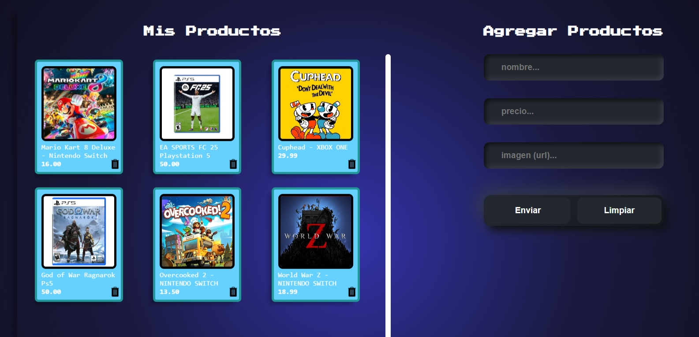
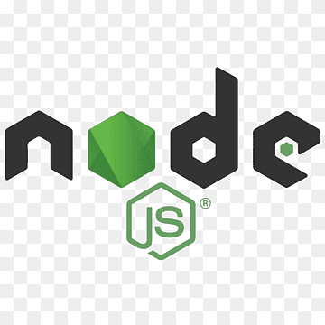
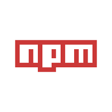

# Descripción 📑  
Este proyecto es parte del desafío de Alura Latam - ONE - Oracle Next Education. La aplicación permite gestionar productos mediante una interfaz amigable, donde los usuarios pueden visualizar, agregar y eliminar productos de manera sencilla. Construida con HTML, CSS y JavaScript, la aplicación emplea conceptos avanzados como programación asíncrona, llamadas HTTP, validación de formularios y manipulación avanzada del DOM, brindando una experiencia fluida y eficiente.

## Aspectos Generales del Proyecto ⚠️  
Este proyecto ha sido desarrollado para cumplir con los requerimientos del desafío.  
- En el entorno de producción, usamos [MockAPI](https://mockapi.io/) como servidor simulado para manejar las solicitudes de manera eficiente.
- Toma en cuenta que MockAPI es un recurso gratuito y, por lo tanto, puede tener limitaciones de tiempo de respuesta.
- Para el entorno de desarrollo, simulamos un servidor remoto usando `json-server` con el archivo `db.json`, lo que facilita las pruebas locales.

## Requisitos Previos 📝  
- Este proyecto requiere tener Node.js y npm instalados para manejar dependencias. Verifica que ambas herramientas estén actualizadas para una mejor compatibilidad.
- Revisa los formatos sugeridos para ingresar datos, como URLs válidas para imágenes (ejemplo: `http://ejemploUrl.com`) y precios en formato numérico usando `.` como decimal.
- El proyecto se encuentra en fase de desarrollo, por lo que puede haber errores no detectados. Si encuentras algún problema, no dudes en enviar comentarios por mensaje directo o correo electrónico.

## Instalación y Uso 💻  

1. **Clona este repositorio**:
   ```
   git clone https://github.com/MarioDev0596/AluraGeek_Desafio.git
    ```
2. **Ingresa al directorio del proyecto**:
    ```bash
    cd AluraGeek_Desafio
    ```
3. **Instala las dependencias necesarias según package.json**:
    ```bash
    npm install
    ```
4. **Selecciona la rama de desarrollo para un entorno local**:
    ```bash
    git checkout develop
    ```
5. **Inicia el servidor de desarrollo**:
    ```bash
    npm run start
    ```
6. Abre el archivo index.html usando la extensión Live Server para visualizar la página en tu navegador.

7. Prueba las funcionalidades de la aplicación. La aplicación permite cargar productos desde db.json, agregar nuevos elementos y eliminarlos.

8. Configuración de URL de la API. En conexionAPI.js, ajusta la constante url para trabajar con el servidor simulado en MockAPI. Comenta la URL de desarrollo (con formato localhost:3001) y descomenta la de producción. La aplicación usa por defecto la URL del archivo db.json local para facilitar el desarrollo.

Nota: Si decides trabajar con MockAPI, el paso 6 no será necesario, ya que estarás consumiendo datos desde la API remota directamente.

## Captura del Proyecto 📷

<p align="center">
  
</p>

## 💻 Tecnologías Usadas

<p align="center">
   <span>HTML</span> &nbsp; 
   <span>CSS</span> &nbsp;
   <span>JavaScript</span> &nbsp;
   <span>NodeJS</span> &nbsp;
   <span>Npm</span>
</p>
